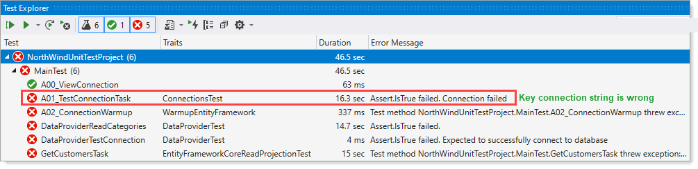

# About

For validating 

- Entity Framework Core againsts NorthWind2020 database
- SqlClient againsts NorthWind2020 database


In English terms, the code expects a SQL-Server connection for SQL-Server Express edition as shown below

```
Data Source=.\\SQLEXPRESS;Initial Catalog=NorthWind2020;Integrated Security=True
```

If the developer runs the unit and fails the reason is either a permission issue or they are using a developer edition of SQL-Server which will fail with the above connection string.

For developer edition of SQL-Server the following change is required.

`Data Source=SERVER-NAME;Initial Catalog=NorthWind2020;Integrated Security=True`

**SERVER-NAME** is the name of your SQL-Server, you can find it when logging into SSMS (SQL-Server Management Studio).

This means that the following file `appsettings.json` in the unit test and class project you need to replace `.\\SQLEXPRES` with SERVER-NAME what ever it may be.
 file 


```json
{
  "database": {
    "DatabaseServer": ".\\SQLEXPRESS",
    "Catalog": "NorthWind2020",
    "IntegratedSecurity": "true",
    "UsingLogging": "true"
  }
}
```

Both appsettings.json are the exact same file using a link. Alter one and the other is updated.


In the unit test project this code gets the connection string from appsettings.json

```csharp
protected static string BuildConnection()
{

    var configuration = (new ConfigurationBuilder()).AddJsonFile("appsettings.json", true, true).Build();

    var sections = configuration.GetSection("database").GetChildren().ToList();

    return $"Data Source={sections[1].Value};Initial Catalog={sections[0].Value};Integrated Security={sections[2].Value}";

}

protected static string ConnectionString => BuildConnection();
```
Same goes for NorthWind2020 in NorthwindContext.cs

```csharp
protected override void OnConfiguring(DbContextOptionsBuilder optionsBuilder)
{
    if (!optionsBuilder.IsConfigured)
    {
        optionsBuilder.UseSqlServer(BuildConnection())
            .EnableSensitiveDataLogging()
            .LogTo(message => Debug.WriteLine(message));
    }
}
private static string BuildConnection()
{

    var configuration = (new ConfigurationBuilder()).AddJsonFile("appsettings.json", true, true).Build();

    var sections = configuration.GetSection("database").GetChildren().ToList();
    
    return $"Data Source={sections[1].Value};Initial Catalog={sections[0].Value};Integrated Security={sections[2].Value}";

}
```
### Results of incorrect connection string



### Results of correct connection string


